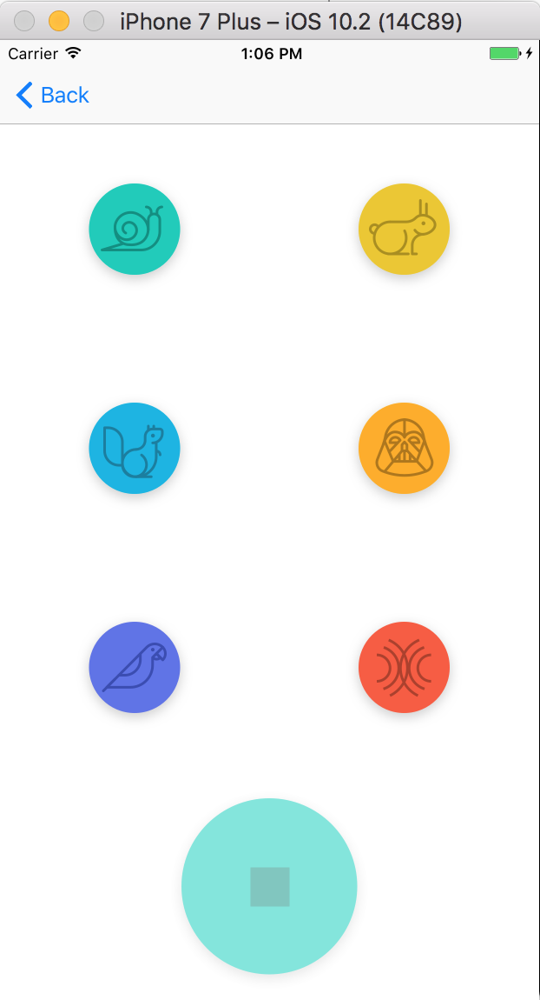

# ios-PitchPerfect

> What's Pitch Perfect?

This is an iOS app that you can record audio and play it in several ways.

> What are the additional features?

* User can save audio
* User can play audio:
  - Slow
  - Fast
  - High Pitch
  - Low Pitch
  - Echo
  - Reverb
  
## Walkthrough
[] (https://youtu.be/0M38kBvScP8)

## License
* [Apache Version 2.0](http://www.apache.org/licenses/LICENSE-2.0.html)
 
## Acknowledgements

* [Audio Engine](https://developer.apple.com/reference/avfoundation/avaudioengine)
* [Audio Node](https://developer.apple.com/reference/avfoundation/avaudionode)
* [Stack View](https://developer.apple.com/library/content/documentation/UserExperience/Conceptual/AutolayoutPG/LayoutUsingStackViews.html)
* [Swift] (https://developer.apple.com/swift/)
